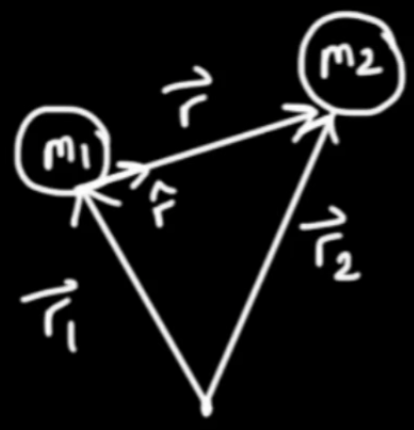

# 6. Geometric Algebra Applications-Kepler Problem (Part 1)

## Set up the problem

- $\ddot{\vec r}=\frac{-G(m_1+m_2)}{r^2}\hat r,\mu=G(m_1+m_2)\\$

## Two conserved quantities

### Angular momentum

- angular momentum $\vec L=\vec r\times m\dot{\vec r}=\vec r\times \vec p$

$$
H=\vec r\wedge\dot{\vec r}\\
\frac{\mathbf{d}H}{\mathbf{d}t}=\frac{\mathbf{d}}{\mathbf{d}t}(\vec r\wedge\dot{\vec r})\\
=\dot{\vec r}\wedge\dot{\vec r}+\vec r\wedge\ddot{\vec r}\\
=\vec r\wedge\ddot{\vec r}\\
\ddot{\vec r}=\frac{-\mu}{r^2}\hat r\\
\frac{\mathbf{d}H}{\mathbf{d}t}=0
$$

- Kepler's second law

$$
dA=\frac{1}{2}\vec r\wedge(\dot{\vec r}dt)\\
\frac{\mathbf{d}A}{\mathbf{d}t}=\dot A=\frac{1}{2}\vec r\wedge\dot{\vec r}=\frac{1}{2}H=\mathbf{Const}
$$

### Energy

$$
\hat r=\frac{\vec r}{r},\vec r=r\hat r\\
H=(r\hat r)\wedge(\dot r\hat r+r\dot{\hat r})\\
=(r\hat r)\wedge(r\dot{\hat r})=r^2(\hat r\wedge \dot{\hat r})\\
=r^2(\hat r\dot{\hat r}-\hat r\cdot\dot{\hat r})\\
\hat r\cdot\dot{\hat r}=\frac{1}{2}\frac{\mathbf{d}}{\mathbf{d}t}(\hat r\cdot\hat r)=\frac{1}{2}\frac{\mathbf{d}}{\mathbf{d}t}(|\hat r|^2)=\frac{1}{2}\frac{\mathbf{d}}{\mathbf{d}t}(1)=0\\
H=r^2\hat r\dot{\hat r}
$$

$$
\ddot{\vec r}\cdot\dot{\vec r}=\frac{-\mu}{r^2}\hat r\cdot\dot{\vec r}\\
\frac{1}{2}\frac{\mathbf{d}}{\mathbf{d}t}(\dot{\vec r}\cdot\dot{\vec r})=\frac{-\mu}{r^2}\hat r\cdot(\dot r\hat r+r\dot{\hat r}),\hat r\cdot\dot{\hat r}=0\\
\frac{1}{2}\frac{\mathbf{d}}{\mathbf{d}t}(\dot{\vec r}\cdot\dot{\vec r})=\frac{-\mu}{r^2}\dot r\\
\frac{1}{2}\frac{\mathbf{d}}{\mathbf{d}t}(v^2)=\frac{\mathbf{d}}{\mathbf{d}t}(\frac{\mu}{r})\\
\frac{\mathbf{d}}{\mathbf{d}t}(\frac{1}{2}v^2-\frac{\mu}{r})=0
$$

